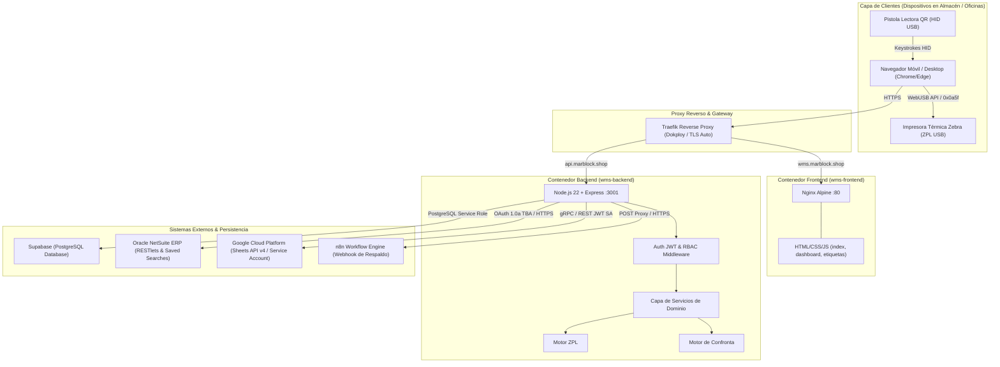
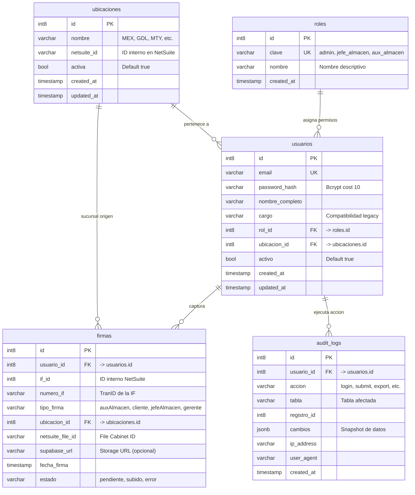
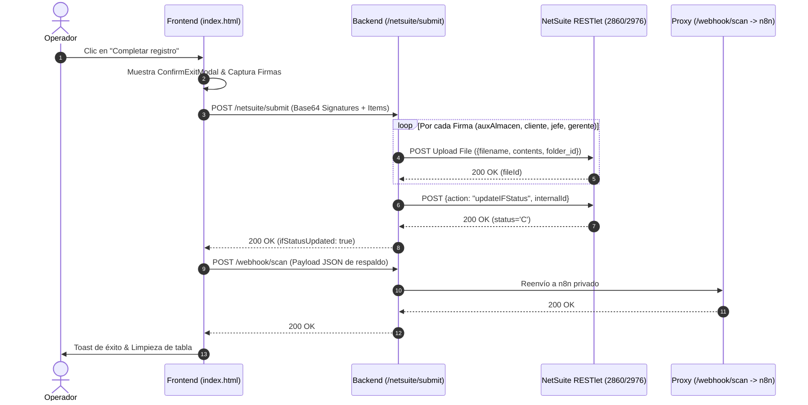

# WMS (Warehouse Management System) — Documentación Técnica de Arquitectura e Integraciones

> **Sistema de Gestión de Almacén (WMS)** para escaneo y despacho de placas, auditoría/confronta en tiempo real con NetSuite y Google Sheets, e impresión térmica de etiquetas industriales Zebra con vinculación aduanal.
>
> **Versión del Sistema**: 3.0.0 (Multi-Módulo)  
> **Área**: Ingeniería de Software & Operaciones TI  
> **Stack Principal**: Node.js 22 (Alpine) · Express 4 · Vanilla JS Modular (Frontend Nginx) · Supabase (PostgreSQL + RLS) · NetSuite TBA (SuiteScript 2.x RESTlet/UserEvent) · Google Sheets API v4 (GCP Service Account) · Motor ZPL / WebUSB API · Dokploy + Traefik (Docker Compose / TLS).

---

## Tabla de Contenidos

1. [Visión General del Sistema y Arquitectura Global](#1-visión-general-del-sistema-y-arquitectura-global)
   - 1.1 Propósito y Objetivos de Negocio
   - 1.2 Módulos del Ecosistema
   - 1.3 Diagrama de Arquitectura C4 (Nivel Contenedores)
   - 1.4 Flujo de Datos Transversal
2. [Control de Acceso, Roles (RBAC) y Modelo de Datos](#2-control-de-acceso-roles-rbac-y-modelo-de-datos)
   - 2.1 Matriz de Roles y Permisos (RBAC)
   - 2.2 Navegación Modular Dinámica (`js/nav.js`)
   - 2.3 Modelo de Datos Relacional (PostgreSQL / Supabase)
   - 2.4 Matriz y Reglas de Segmentación Geográfica de Ubicaciones
3. [Módulo 1: Escáner de Salidas y Firmas Digitales (`index.html`)](#3-módulo-1-escáner-de-salidas-y-firmas-digitales)
   - 3.1 Arquitectura del Escáner (Pistola HID vs Cámara)
   - 3.2 Motor de Captura por Timing y Deduplicación (`js/scanner.js`)
   - 3.3 Parser de Códigos QR (`js/qr-parser.js`)
   - 3.4 Captura Responsiva de Firmas en Canvas (`js/signatures.js`)
   - 3.5 Pipeline de Envío, Cierre de IF y Proxy Webhook (`js/netsuite-client.js`, `js/webhook.js`)
4. [Módulo 2: Dashboard de Confronta Supply Chain (`dashboard.html`)](#4-módulo-2-dashboard-de-confronta-supply-chain)
   - 4.1 Arquitectura de la Confronta en Tiempo Real
   - 4.2 Algoritmo de Conversión $m^2 \to \text{Placas}$ (`loteParser.js`)
   - 4.3 Taxonomía y Detección de Discrepancias (`confrontaService.js`)
   - 4.4 Rendimiento: Caché en Memoria y Patrón Single-Flight
   - 4.5 Interfaz Analítica, Visualizaciones y Auditoría por Partida (`js/dashboard/app.js`)
5. [Módulo 3: Impresión de Etiquetas Zebra & Motor ZPL (`etiquetas.html`)](#5-módulo-3-impresión-de-etiquetas-zebra--motor-zpl)
   - 5.1 Flujo Dual de Operación (Stock Disponible vs Recepción IR)
   - 5.2 Consulta y Desambiguación de Pedimentos Aduanales (`irService.js`)
   - 5.3 Motor Geométrico ZPL y Auto-Escalado Tipográfico (`zplService.js`)
   - 5.4 Driver de Impresión WebUSB y Fallback Local (`js/etiquetas/app.js`)
6. [Referencia Completa de la API REST del Backend](#6-referencia-completa-de-la-api-rest-del-backend)
   - 6.1 Catálogo de Endpoints
   - 6.2 Middlewares de Seguridad y Control de Acceso
   - 6.3 Especificación Detallada de Contratos (Request / Response)
7. [Arquitectura de Servicios del Backend (`backend/services/`)](#7-arquitectura-de-servicios-del-backend)
   - 7.1 `confrontaService.js`
   - 7.2 `googleSheetsService.js`
   - 7.3 `netsuiteSearchService.js`
   - 7.4 `existenciasService.js`
   - 7.5 `irSearchService.js`
   - 7.6 `irService.js`
   - 7.7 `loteParser.js`
   - 7.8 `zplService.js`
   - 7.9 `netsuiteFileService.js`
8. [Integración con NetSuite](#8-integración-con-netsuite)
   - 8.1 Protocolo de Autenticación Token-Based Authentication (OAuth 1.0a TBA)
   - 8.2 Catálogo de Búsquedas Guardadas (Saved Searches)
   - 8.3 RESTlet 2217 (`searchResults.js`) — Ejecutor Genérico
   - 8.4 RESTlet 2860 / 2976 (`wms_restlet.js`) — Subida de Archivos y Cambio de Estado
   - 8.5 UserEvent Script `wms_link_firmas.js` — Vinculación Automática
   - 8.6 Advanced PDF/HTML Template `wms_firma_template.xml`
   - 8.7 Estructura Física del File Cabinet
9. [Integración con Google Cloud & Google Sheets](#9-integración-con-google-cloud--google-sheets)
   - 9.1 Arquitectura Service Account vs OAuth Humano
   - 9.2 Esquema y Normalización de Columnas
   - 9.3 Gestión de Fechas Regionales y Rotación de Secretos
10. [Infraestructura, Docker y Despliegue (Dokploy)](#10-infraestructura-docker-y-despliegue-dokploy)
    - 10.1 Composición de Servicios Docker (`docker-compose.dokploy.yml`)
    - 10.2 Configuración Dinámica de Frontend (`config.template.js` + `envsubst`)
    - 10.3 Catálogo Exhaustivo de Variables de Entorno
11. [Runbook Técnico y Guía de Troubleshooting](#11-runbook-técnico-y-guía-de-troubleshooting)
    - 11.1 Fallos de Autenticación NetSuite TBA (401 / 403)
    - 11.2 Errores de Conectividad con Google Sheets API (400 / 403 / ENOENT)
    - 11.3 Diagnóstico de Impresión WebUSB y Zebra
    - 11.4 Incidencias del Escáner Físico HID y Cámara
    - 11.5 Procedimiento para Agregar Nuevas Sucursales o Columnas
12. [Roadmap Técnico y Registro de Cambios](#12-roadmap-técnico-y-registro-de-cambios)

---

## 1. Visión General del Sistema y Arquitectura Global

### 1.1 Propósito y Objetivos de Negocio

El sistema **WMS (Warehouse Management System)** es la plataforma técnica centralizada para la operación de almacén, control de calidad en despachos y trazabilidad aduanal de placas de materiales (mármol, granito, cuarzo, superficies sinterizadas). 

Sus metas funcionales y de ingeniería son:
1. **Despacho Digital y Firma Legal**: Eliminar el papel en salidas de almacén capturando firmas digitales con validez interna e insertándolas de manera automatizada en las Instrucciones de Fabricación (Item Fulfillments - IF) de NetSuite.
2. **Confronta y Auditoría en Tiempo Real**: Confrontar lo físicamente retirado y escaneado contra las líneas y metros cuadrados comprometidos en NetSuite, identificando discrepancias de inmediato para evitar errores de surtido.
3. **Etiquetado Estandarizado de Inventario**: Proveer a los jefes de almacén de una herramienta para generar e imprimir etiquetas industriales en lenguaje ZPL vía WebUSB con códigos QR estandarizados y vinculación directa a los pedimentos aduanales de importación.

### 1.2 Módulos del Ecosistema

El frontend se divide en **tres aplicaciones SPA independientes (Single Page Applications)** servidas por Nginx, que comparten estilos, autenticación y sesión:

```
┌─────────────────────────────────────────────────────────────────────────────┐
│                           WMS FRONTEND ECOSYSTEM                            │
├──────────────────────────┬──────────────────────────┬───────────────────────┤
│  1. Escáner de Salidas   │  2. Dashboard Confronta  │ 3. Etiquetas Zebra    │
│  (index.html)            │  (dashboard.html)        │ (etiquetas.html)      │
│  • Escaneo rápido QR HID │  • Cruce NetSuite vs GSheets • Búsqueda de Stock │
│  • Validación IF abierta │  • KPIs de exactitud     │ • Detalle de IRs      │
│  • Captura de firmas 2x2 │  • Auditoría de errores  │ • Pedimento aduanal   │
│  • Subida y cierre de IF │  • Top causas raíz       │ • Generador ZPL / USB │
└──────────────────────────┴──────────────────────────┴───────────────────────┘
```

### 1.3 Diagrama de Arquitectura C4 (Nivel Contenedores)



### 1.4 Flujo de Datos Transversal

1. **Escaneo y Despacho**: El operador escanea placas en `index.html`. Al completar, el backend sube las firmas PNG al File Cabinet de NetSuite vía RESTlet 2860/2976 y actualiza el `shipstatus` de la IF a `'C'` (Shipped). Paralelamente, vía proxy `/webhook/scan`, los ítems escaneados se registran en una hoja de Google Sheets (vía n8n).
2. **Confronta y Auditoría**: El `dashboardController` consulta de forma periódica o a demanda las IFs enviadas en NetSuite (`customsearch3679`/`3675`) y lee las filas registradas en Google Sheets vía Service Account. El motor de confronta cruza ambos conjuntos por `(if_tranid, sku, lote)`, detecta discrepancias de cantidad o ubicación, y expone los resultados a `dashboard.html`.
3. **Impresión de Identificación**: Desde `etiquetas.html`, el jefe de almacén consulta existencias o recepciones (IRs). El backend localiza el lote, extrae el pedimento aduanal de `customsearch3677` y construye el script ZPL, enviándolo directamente a la impresora mediante WebUSB.

---

## 2. Control de Acceso, Roles (RBAC) y Modelo de Datos

### 2.1 Matriz de Roles y Permisos (RBAC)

La autenticación se realiza mediante tokens JWT firmados (`HS256`, 24h de expiración). La autorización está implementada en base a roles almacenados en la base de datos Supabase.

| Rol (`roles.clave`) | Destino Post-Login | Escáner (`index.html`) | Etiquetas (`etiquetas.html`) | Dashboard (`dashboard.html`) | Registro Usuarios (`/auth/register`) |
|---|---|:---:|:---:|:---:|:---:|
| `aux_almacen` | `index.html` | ✅ Lectura / Despacho | ❌ Sin acceso | ❌ Sin acceso | ❌ Sin acceso |
| `jefe_almacen` | `index.html` | ✅ Lectura / Despacho | ✅ Consulta / Impresión | ❌ Sin acceso | ❌ Sin acceso |
| `gerente` | `dashboard.html` | ✅ Lectura / Firma | ❌ Sin acceso | ✅ Auditoría Sucursal (Filtro por sucursal) | ❌ Sin acceso |
| `admin` | `dashboard.html` | ✅ Control Total | ✅ Control Total | ✅ Auditoría Global (Todas las sucursales) | ✅ Exclusivo Admin |
| `cliente` | `index.html` | ✅ Solo Firma | ❌ Sin acceso | ❌ Sin acceso | ❌ Sin acceso |

> **Firmas Físicas vs Roles de Sesión**: Las firmas de `jefeAlmacen` y `gerente` solicitadas durante el despacho de placas son **etiquetas de firma en el canvas** requeridas por volumen (>3 placas requiere jefe, >10 requiere gerente) y son independientes de quién haya iniciado sesión en la aplicación.

### 2.2 Navegación Modular Dinámica (`js/nav.js`)

El componente `js/nav.js` se ejecuta en `DOMContentLoaded` en todas las páginas e inyecta la barra de navegación `#appNav` evaluando el rol del usuario en `sessionStorage`:

- **Usuarios `aux_almacen` y `cliente`**: No se muestra barra de navegación (quedan confinados al escáner de despacho).
- **Usuarios `jefe_almacen`**: Se renderizan accesos a **Escáner** y **Etiquetas**.
- **Usuarios `gerente`**: Se renderizan accesos a **Escáner** y **Dashboard** (con alcance prefiltrado a su sucursal).
- **Usuarios `admin`**: Se renderizan accesos a **Escáner**, **Etiquetas** y **Dashboard** (con selector global de todas las sucursales habilitado).

### 2.3 Modelo de Datos Relacional (PostgreSQL / Supabase)



### 2.4 Matriz y Reglas de Segmentación Geográfica de Ubicaciones

La visibilidad de registros (tanto en el Escáner como en el módulo de Etiquetas) está regulada por la ubicación del usuario:

1. **Ubicaciones Restringidas (Sucursales Principales)**: Aquellas cuyos prefijos coinciden con `RESTRICTED_LOCATION_PREFIXES = ['MEX', 'MTY', 'GDL']`.
2. **Regla de Inclusión de Outlets**: Las ubicaciones compuestas (ej. `GDL:OUTLET GDL`, `OUTLET MEX`) son visibles para los usuarios de la sucursal padre mediante coincidencia por token `[\s:]+` o prefijo `OUTLET <SUCURSAL>`.
3. **Ubicaciones Compartidas (Whitelist & Abiertas)**: Cualquier ubicación listada en `SHARED_LOCATIONS = ['TEMPORAL', 'PROYECTOS', 'Material Transformado', 'MATRIZ']` o que **no** empiece con un prefijo restringido (ej. `TIJUANA`, `PUEBLA`) es accesible para todos los usuarios.
4. **Excepción de Administrador**: El rol `admin` tiene bypass de ubicación y puede consultar la totalidad de sucursales e inventarios del país.

---

## 3. Módulo 1: Escáner de Salidas y Firmas Digitales

### 3.1 Arquitectura del Escáner (Pistola HID vs Cámara)

El escáner (`js/scanner.js`) implementa un diseño de **fuente dual** que converge en una canalización única de procesamiento:

```
┌─────────────────────────┐
│ Pistola QR (USB HID)    │─── keydown (<50ms) ───┐
└─────────────────────────┘                       │
                                                  ▼
┌─────────────────────────┐              ┌──────────────────┐      ┌──────────────────┐      ┌──────────────────┐
│ Cámara Web (Html5Qrcode)│─── Frame OCR ─►│  handleScan()    │─────►│  parseQR()       │─────►│  addRecord()     │
│ (Modo Fallback)         │              │  • Dedupe (3s)   │      │  (Valida 3 campos│      │  (Renderizado de │
└─────────────────────────┘              └──────────────────┘      │   SKU LOTE UBIC) │      │   Tabla HTML)    │
                                                                   └──────────────────┘      └──────────────────┘
```

### 3.2 Motor de Captura por Timing y Deduplicación (`js/scanner.js`)

El escáner físico emite caracteres a intervalos de entre 5 y 30 milisegundos finalizando con una tecla de terminación (`Enter` o `Tab`).

- **Diferenciación Humano vs Pistola**: Si un evento `keydown` ocurre dentro de un campo de formulario (`<input>`, `<select>`), el sistema evalúa el delta de tiempo:
  $$\Delta t = t_{\text{actual}} - t_{\text{anterior}}$$
  Si $\Delta t > 50\text{ ms}$, se considera tipeo humano manual y no se interfiere con el input. Si $\Delta t \le 50\text{ ms}$, los caracteres se extraen hacia el buffer del escáner y se ejecuta `blur()` sobre el elemento activo.
- **Deduplicación**: Para evitar dobles lecturas accidentales, si el mismo código escaneado se recibe en una ventana menor a $3000\text{ ms}$ ($3\text{ segundos}$), se descarta silenciosamente.

### 3.3 Parser de Códigos QR (`js/qr-parser.js`)

El parser valida que la cadena contenga exactamente la estructura industrial requerida:

$$\text{QR Cadena} = \underbrace{\text{SKU}}_{\text{Token 1}}\quad\underbrace{\text{LOTE}}_{\text{Token 2}}\quad\underbrace{\text{UBICACIÓN}}_{\text{Token 3}}$$

Ejemplo válido: `030LTH 12572-3.16X1.96 GDL` $\implies$ `{ tipo: 'placa', sku: '030LTH', lote: '12572-3.16X1.96', ubicacion: 'GDL' }`.

### 3.4 Captura Responsiva de Firmas en Canvas (`js/signatures.js`)

- **Escalado 1:1**: El canvas de firma utiliza mapeo 1:1 entre el tamaño CSS y la resolución interna (sin `ctx.scale`), eliminando distorsiones o desplazamientos de puntero en pantallas móviles o tablets.
- **ResizeObserver**: Detecta cambios de orientación del dispositivo recalculando `syncCanvasSize()` y preservando los trazos previos en memoria temporal.
- **Bloqueo de Scroll**: Durante la firma activa en modales, se inyecta `overflow: hidden` en el `body` para evitar scroll elástico en dispositivos táctiles.

### 3.5 Pipeline de Envío, Cierre de IF y Proxy Webhook

Al presionar "Completar registro", el frontend ejecuta la secuencia:



---

## 4. Módulo 2: Dashboard de Confronta Supply Chain

### 4.1 Arquitectura de la Confronta en Tiempo Real

El módulo de confronta (`dashboard.html`) audita la coincidencia entre los despachos planeados en NetSuite y los escaneos físicos registrados en la hoja de Google Sheets.

```
┌────────────────────────────────────────┐       ┌────────────────────────────────────────┐
│  NetSuite ERP (customsearch3679/3675)  │       │  Google Sheets (Hoja de Escaneos WMS)  │
│  • IF TranID                           │       │  • IF TranID                           │
│  • SKU comprometido                    │       │  • SKU escaneado                       │
│  • Lote con medidas (inventorynumber)  │       │  • Lote escaneado                      │
│  • Cantidad en m² (quantity)           │       │  • Ubicación escaneada / Operador      │
└───────────────────┬────────────────────┘       └───────────────────┬────────────────────┘
                    │                                                │
                    ▼                                                ▼
         netsuiteSearchService.js                          googleSheetsService.js
                    │                                                │
                    └───────────────────────┬────────────────────────┘
                                            ▼
                                   confrontaService.js
                               • Matching: (IF, SKU, Lote)
                               • Conversión: m² / Área Placa
                               • Detección de Discrepancias
                                            ▼
                                  dashboardController.js
                                (Caché TTL 15s + Single-Flight)
```

### 4.2 Algoritmo de Conversión $m^2 \to \text{Placas}$ (`loteParser.js`)

NetSuite gestiona el inventario de placas en metros cuadrados ($m^2$), mientras que el operador escanea piezas unitarias (placas). El parser `loteParser.js` extrae las dimensiones físicas desde la nomenclatura del lote:

$$\text{Formato Lote} = \{\text{ID}\}-\{\text{Largo}\}\text{X}\{\text{Ancho}\}$$

Ejemplo: `15760-3.14X1.96` $\implies \text{Largo} = 3.14\text{ m}, \text{Ancho} = 1.96\text{ m}$.

$$\text{Área de la Placa } (A) = \text{Largo} \times \text{Ancho} = 3.14 \times 1.96 = 6.1544\text{ m}^2$$

$$\text{Placas Esperadas } (P_{\text{esp}}) = \text{round}\left( \frac{\text{Cantidad en } m^2}{A} \right)$$

Si el lote no contiene dimensiones válidas (ej. `L2406-A`), se clasifica como `sin_medidas` y se audita únicamente la coincidencia de SKU, lote y ubicación física.

### 4.3 Taxonomía y Detección de Discrepancias (`confrontaService.js`)

El motor de confronta evalúa cada partida y genera discrepancias tipificadas:

| Tipo de Discrepancia | Condición Lógica | Severidad |
|---|---|:---:|
| `cantidad_faltante` | $P_{\text{escaneadas}} < P_{\text{esperadas}}$ | 🔴 Crítico |
| `cantidad_sobrante` | $P_{\text{escaneadas}} > P_{\text{esperadas}}$ | 🟡 Advertencia |
| `ubicacion_incorrecta` | $\text{Ubicación Escaneada} \ne \text{Ubicación Esperada}$ | 🟡 Advertencia |
| `sku_lote_no_esperado` | El escaneo no pertenece a ninguna línea de la IF (Placa Huérfana) | 🔴 Crítico |
| `linea_faltante` | $P_{\text{escaneadas}} = 0$ para un ítem comprometido en la IF | 🔴 Crítico |
| `if_no_encontrada` | IF presente en escaneos de Sheets pero inexistente en NetSuite | 🔴 Crítico |
| `sin_medidas` | El lote no cuenta con dimensiones para calcular placas teóricas | ℹ️ Informativo |

$$\text{Tasa de Exactitud} = \left( \frac{\text{Total Líneas} - \text{Líneas con Error}}{\text{Total Líneas}} \right) \times 100$$

### 4.4 Rendimiento: Caché en Memoria y Patrón Single-Flight

Al cargar o filtrar el dashboard, el cliente ejecuta hasta 9 llamadas simultáneas. Para proteger los límites de concurrencia de NetSuite y evitar bloqueos por rate limit (HTTP 400):
1. **Caché en Memoria (TTL 15s)**: Almacena la confronta consolidada indexada por filtros `(desde, hasta, sucursal)`.
2. **Single-Flight Lock**: Si múltiples solicitudes con los mismos filtros llegan concurrentemente mientras el caché está expirado, todas se enlazan a la misma `Promise` en ejecución, garantizando **una sola consulta** a NetSuite y Google Sheets.

### 4.5 Interfaz Analítica, Visualizaciones y Auditoría por Partida (`js/dashboard/app.js`)

- **Presets de Fecha**: `Hoy`, `Esta semana`, `Este mes`, `Mes pasado` y `Personalizado`.
- **Gráficos Chart.js**: Gráfico de Dona para Tasa de Exactitud y Gráfico de Barras horizontales para Top 5 Artículos con Mayor Salida.
- **Auditoría Partida por Partida**: Modal interactivo que desglosa cada IF, comparando SKU, lote, piezas esperadas, escaneadas, status visual y el historial del operador que realizó la lectura.

---

## 5. Módulo 3: Impresión de Etiquetas Zebra & Motor ZPL

### 5.1 Flujo Dual de Operación (Stock Disponible vs Recepción IR)

El módulo de etiquetado (`etiquetas.html`) soporta dos flujos de trabajo operativos:

```
                               ┌─────────────────────────────────────────┐
                               │  MÓDULO DE ETIQUETADO (etiquetas.html)  │
                               └────────────────────┬────────────────────┘
                                                    │
                   ┌────────────────────────────────┴────────────────────────────────┐
                   ▼                                                                 ▼
    ┌─────────────────────────────┐                                   ┌─────────────────────────────┐
    │     1. MODO STOCK (LOTE)    │                                   │    2. MODO RECEPCIÓN (IR)   │
    ├─────────────────────────────┤                                   ├─────────────────────────────┤
    │ • Consulta: customsearch_items│                                 │ • Consulta: customsearch3678│
    │ • Filtro: Sucursal y Outlets│                                   │ • Búsqueda universal        │
    │ • Cálculo: Máx = Físico/m²  │                                   │ • Modal de Desglose de Líneas│
    │ • Pedimento: customsearch3677│                                  │ • Placas calculadas por lote│
    │ • Adición a Carrito de Imp. │                                   │ • Impresión directa o Carrito│
    └──────────────┬──────────────┘                                   └──────────────┬──────────────┘
                   │                                                                 │
                   └────────────────────────────────┬────────────────────────────────┘
                                                    ▼
                                    ┌───────────────────────────────┐
                                    │      MOTOR ZPL (Backend)      │
                                    │ • Layout fijo 101x19 mm       │
                                    │ • QR Versión 3 (29x29)        │
                                    │ • fitFont tipográfico         │
                                    │ • Concatenación ZPL Bulk      │
                                    └───────────────┬───────────────┘
                                                    ▼
                                    ┌───────────────────────────────┐
                                    │  DRIVER WEBUSB (Frontend)     │
                                    │ • Vendor ID: 0x0a5f (Zebra)   │
                                    │ • transferOut(endpoint, ZPL)  │
                                    │ • Fallback: Descarga .zpl     │
                                    └───────────────────────────────┘
```

### 5.2 Consulta y Desambiguación de Pedimentos Aduanales (`irService.js`)

Dado un lote en inventario, el servicio `irService.js` consulta `customsearch3677` y resuelve el número de pedimento de importación y el embarque:

- **Priorización de Texto**: NetSuite devuelve los pedimentos aduanales como objetos `{ value: ID, text: "26  43  1637  6102487" }`. El backend extrae obligatoriamente el campo `.text` y colapsa espacios múltiples para garantizar que se imprima el folio oficial y no el ID interno.
- **Desambiguación de Múltiples Pedimentos**: Si un lote fue recibido en múltiples momentos con diferentes pedimentos en la misma sucursal, el API retorna `multiple: true` y una lista de opciones para que el usuario elija en el carrito antes de imprimir.

### 5.3 Motor Geométrico ZPL y Auto-Escalado Tipográfico (`zplService.js`)

Las etiquetas térmicas están diseñadas para material de **101 mm de ancho $\times$ 19 mm de alto** ($807 \times 152\text{ dots}$ a una resolución de $203\text{ dpi}$).

```
0,0 ─────────────────────────────────────────────── 650,0 ────────────── 807,0
│  Línea 1: [SKU] [Descripción del Material]        │                   │
│  Línea 2: [Lote]   [Total m²]   [N° de Placa]     │    CÓDIGO QR      │
│  Línea 3: [EMBARQUE] | [UBICACIÓN] | PED: [N°]    │    ESTANDARIZADO  │
│                                                   │    (29x29 dots)   │
0,152 ───────────────────────────────────────────── 650,152 ──────────── 807,152
```

- **QR Estándar Invariante**: Se utiliza QR Versión 3 (matriz $29 \times 29$) con corrección de error nivel `L` y padding de longitud fija (`ZPL_QR_FIXED_LEN=45`). El contenido es `SKU LOTE UBICACION`.
- **Ajuste Tipográfico Dinámico (`fitFont`)**: Para evitar que descripciones largas desborden la etiqueta o se solapen con el QR:
  $$\text{FontSize} = \max\left( \text{minSize}, \min\left( \text{maxSize}, \text{floor}\left(\frac{\text{AnchoDisponible}}{\text{LongitudTexto} \times 0.5}\right) \right) \right)$$
- **Saneamiento ZPL**: Se eliminan caracteres de control reservados (`^` y `~`) de cualquier variable inyectada.

### 5.4 Driver de Impresión WebUSB y Fallback Local

- **Conexión Directa**: `navigator.usb.requestDevice({ filters: [{ vendorId: 0x0a5f }] })` solicita acceso al puerto USB de la impresora Zebra, reclama la interfaz 0 y envía el buffer de bytes codificado en UTF-8 mediante `transferOut()`.
- **Fallback Automático**: Si el navegador no soporta WebUSB (ej. Firefox) o se ejecuta en un contexto no seguro (HTTP no localhost), el sistema descarga un archivo `etiquetas.zpl` para envío por utilería o spooler local.

---

## 6. Referencia Completa de la API REST del Backend

### 6.1 Catálogo de Endpoints

| Router | Método | Path | Auth | Roles Permitidos | Descripción |
|---|:---:|---|:---:|:---:|---|
| **Auth** | `POST` | `/auth/login` | No | Público | Inicio de sesión $\to$ JWT + Objeto Usuario |
| | `POST` | `/auth/register` | JWT | `admin` | Alta de nuevo usuario corporativo |
| | `GET` | `/auth/user` | JWT | Todos | Rehidratación de sesión del usuario autenticado |
| | `POST` | `/auth/logout` | No | Público | Cierre de sesión (Stateless) |
| | `POST` | `/auth/generate-hash` | No | Solo Dev | Utilidad para generar hashes Bcrypt |
| **OAuth** | `GET` | `/auth/netsuite/oauth/test` | No | Solo Dev | Diagnóstico del flujo OAuth 2.0 |
| | `GET` | `/auth/netsuite/oauth/initiate` | No | Público | Redirección a login de NetSuite (Auth Code) |
| | `GET` | `/auth/netsuite/oauth/callback` | No | Público | Recepción de autorización OAuth 2.0 |
| **NetSuite** | `GET` | `/netsuite/diagnostic` | No | Solo Dev | Prueba de conexión y dummy upload TBA |
| | `GET` | `/netsuite/ifs` | JWT | Todos | Obtiene IFs pendientes filtradas por ubicación |
| | `POST` | `/netsuite/submit` | JWT | Todos | Sube firmas al File Cabinet y cierra IF (`C`) |
| **Firmas** | `POST` | `/firmas/upload` | JWT | Todos | Subida de firmas agrupadas (Legacy) |
| | `POST` | `/firmas/upload/single` | JWT | Todos | Subida de firma individual a folder directo |
| **Validate** | `GET` | `/validate` | No | Solo Dev | Validación integral de configuración y carpetas |
| **Webhook** | `POST` | `/webhook/scan` | JWT | Todos | Proxy seguro hacia el webhook de n8n |
| **Dashboard**| `GET` | `/api/dashboard/health` | No | Público | Healthcheck del subsistema de confronta |
| | `GET` | `/api/dashboard/resumen` | JWT | `gerente`, `admin` | KPIs consolidados y tasa de exactitud |
| | `GET` | `/api/dashboard/sucursales` | JWT | `gerente`, `admin` | Lista de sucursales restringidas para filtros |
| | `GET` | `/api/dashboard/ifs-mal-sacadas`| JWT | `gerente`, `admin` | Listado de IFs con discrepancias |
| | `GET` | `/api/dashboard/if/:tranid/detalle` | JWT | `gerente`, `admin` | Detalle exhaustivo de una IF y sus líneas |
| | `GET` | `/api/dashboard/discrepancias` | JWT | `gerente`, `admin` | Tabla plana de anomalías filtrables |
| | `GET` | `/api/dashboard/top-errores` | JWT | `gerente`, `admin` | Ranking de fallas por SKU, lote, ubicación, operador |
| | `GET` | `/api/dashboard/ifs-ok` | JWT | `gerente`, `admin` | Listado de IFs concluidas con 100% exactitud |
| | `GET` | `/api/dashboard/articulos-mas-salidas` | JWT | `gerente`, `admin` | Top artículos con mayor volumen de piezas |
| **Etiquetas** | `GET` | `/api/etiquetas/existencias` | JWT | `jefe_almacen`, `admin` | Existencias de stock filtradas por sucursal |
| | `GET` | `/api/etiquetas/lotes` | JWT | `jefe_almacen`, `admin` | Lotes disponibles para un SKU específico |
| | `POST` | `/api/etiquetas/pedimento` | JWT | `jefe_almacen`, `admin` | Consulta pedimento aduanal y embarque |
| | `POST` | `/api/etiquetas/zpl` | JWT | `jefe_almacen`, `admin` | Genera código ZPL para un lote individual |
| | `GET` | `/api/etiquetas/irs` | JWT | `jefe_almacen`, `admin` | Listado de Recepciones de Artículo recientes |
| | `GET` | `/api/etiquetas/ir/:idOrTranid` | JWT | `jefe_almacen`, `admin` | Detalle de líneas y placas estimadas de una IR |
| | `POST` | `/api/etiquetas/zpl-bulk` | JWT | `jefe_almacen`, `admin` | Genera ZPL continuo para múltiples partidas |

### 6.2 Middlewares de Seguridad y Control de Acceso

- `verifyToken` (`backend/middleware/auth.js`): Extrae `Authorization: Bearer <token>`, valida firma con `JWT_SECRET` y puebla `req.user`.
- `requireRole(...roles)`: Valida que `req.user.rol` o `req.user.cargo` coincida con los roles autorizados; de lo contrario responde HTTP 403 Forbidden.
- `requireAdmin`: Alias estricto de `requireRole('admin')`.
- `devOnly`: Si `NODE_ENV === 'production'`, intercepta la petición y responde HTTP 404 Not Found para ocultar endpoints de diagnóstico o generación de utilerías.

### 6.3 Especificación Detallada de Contratos (Request / Response)

#### `POST /auth/login`
```jsonc
// Request
{
  "email": "jefe.almacen@marblock.com",
  "password": "PasswordSeguro123!"
}

// Response 200 OK
{
  "token": "eyJhbGciOiJIUzI1NiIsInR5cCI6IkpXVCJ9...",
  "user": {
    "id": 4,
    "nombre": "Roberto González",
    "email": "jefe.almacen@marblock.com",
    "cargo": "jefe_almacen",
    "rol": "jefe_almacen",
    "ubicacion": { "id": 5, "nombre": "GDL" }
  }
}
```

#### `POST /netsuite/submit`
```jsonc
// Request
{
  "ifTranid": "IF14580",
  "ifInternalId": 328491,
  "ubicacion_id": 1,
  "items": [
    { "sku": "030LTH", "lote": "12572-3.16X1.96", "ubicacion": "GDL", "hora": "14:30:00" }
  ],
  "signatures": {
    "auxAlmacen": "data:image/png;base64,iVBORw0KGgo...",
    "cliente": "data:image/png;base64,iVBORw0KGgo..."
  }
}

// Response 200 OK (o 207 Multi-Status si hubo fallo parcial en archivos)
{
  "status": "success",
  "message": "All signatures uploaded successfully to NetSuite",
  "ifTranid": "IF14580",
  "ifInternalId": 328491,
  "location": "MEX",
  "itemsCount": 1,
  "uploadedFiles": [
    {
      "type": "auxAlmacen",
      "label": "Aux. de Almacén",
      "filename": "IF14580_auxAlmacen.png",
      "fileId": 78912,
      "folderId": 12848,
      "url": "https://9080139-sb1.app.netsuite.com/core/media/media.nl?id=78912..."
    }
  ],
  "ifStatusUpdated": true,
  "summary": { "totalSignatures": 2, "successCount": 2, "failureCount": 0 }
}
```

#### `POST /api/etiquetas/zpl-bulk`
```jsonc
// Request
{
  "items": [
    {
      "sku": "117XPB",
      "lote": "10082-2.74X1.88",
      "ubicacion": "MEX",
      "descripcion": "VOLAKAS PLACA 2.0cm PB",
      "totalM2": 5.1512,
      "pedimento": "26 43 1637 6102487",
      "embarque": "EMB-902",
      "cantidad": 2
    }
  ]
}

// Response 200 OK
{
  "zpl": "~SD25\n^XA\n^PW807\n^LL152\n^PR2\n^FO20,18^A0N,26,26^FD117XPB VOLAKAS PLACA 2.0cm PB^FS\n...",
  "totalEtiquetas": 2,
  "totalLotes": 1
}
```

---

## 7. Arquitectura de Servicios del Backend (`backend/services/`)

```
backend/services/
├── confrontaService.js       # Motor central de matching y auditoría NetSuite vs Sheets
├── googleSheetsService.js    # Cliente GCP Service Account, lectura y caché de escaneos
├── netsuiteSearchService.js  # Paginador y normalizador de IFs enviadas desde RESTlet 2217
├── existenciasService.js     # Consulta y normalización de existencias de stock NetSuite
├── irSearchService.js        # Búsqueda, agrupación y placas estimadas de Recepciones (IRs)
├── irService.js              # Sub-búsqueda y desambiguación de pedimento/embarque por lote
├── loteParser.js             # Parser de expresiones regulares para medidas y área
├── zplService.js             # Generador de comandos ZPL II y escalado tipográfico
└── netsuiteFileService.js    # Subida de binarios y firmas PNG a File Cabinet
```

### 7.1 `confrontaService.js`
- **Función `confrontar(ifsEsperadas, escaneos)`**: Cruza ambos arreglos agrupando por clave `if_tranid|sku|lote`.
- **Detección de Huérfanos**: Identifica lecturas en Sheets que no formaban parte de la orden original.
- **IFs Sintéticas**: Si una IF fue escaneada pero no existe en la búsqueda de NetSuite, genera un registro sintético clasificado como `if_no_encontrada`.

### 7.2 `googleSheetsService.js`
- **Autenticación Service Account**: Emplea `google.auth.GoogleAuth` con scope `spreadsheets.readonly`.
- **Normalización de Fechas**: Transforma fechas en formatos latinoamericanos (`DD/MM/YYYY`, `D/M/YYYY`) o ISO a cadenas comparables `YYYY-MM-DD`.

### 7.3 `netsuiteSearchService.js`
- **Paginación Inteligente**: Solicita lotes de 1000 registros al RESTlet 2217. Si detecta que la fecha más antigua de la página es previa al filtro `desde` y no hay folios pendientes de localizar, aplica **terminación temprana** para ahorrar ancho de banda y CPU.

### 7.4 `existenciasService.js`
- **Caché de Stock**: Mantiene en memoria las existencias con un TTL de $60\text{ segundos}$ (`EX_CACHE_TTL`), mapeando campos de bloque, físico, disponible, largo, alto y $m^2$ por pieza.

### 7.5 `irSearchService.js`
- **Agrupación de Recepciones**: Agrupa las líneas devueltas por `customsearch3678` bajo su cabecera `tranid`, calcula métricas consolidadas (`totalLineas`, `totalPlacas`, `totalM2`) y enriquece la descripción consultando el catálogo de existencias.

### 7.6 `irService.js`
- **Resolución de Pedimento**: Dado un lote y sucursal, busca en `customsearch3677`. Mapea tanto sucursales principales como outlets (ej. existencias en `OUTLET MEX` resuelven pedimento registrado en `MEX`).

### 7.7 `loteParser.js`
- **Expresión Regular Robusta**:
  ```js
  /^([\d]+(?:[.,]\d+)?)\s*[xX]\s*([\d]+(?:[.,]\d+)?)/
  ```
  Soporta separadores decimales por punto o coma, espacios variables y `x`/`X`.

### 7.8 `zplService.js`
- **Construcción ZPL**: Ensambla comandos de cabecera (`^XA`, `^PW807`, `^LL152`, `^PR2`, `~SD25`), campos de texto (`^FO`, `^A0N`, `^FD...^FS`) y código QR (`^BQN,2,4^FDLA,...^FS`).

### 7.9 `netsuiteFileService.js`
- **Gestión de Binarios**: Convierte cadenas Base64 a `Buffer` y realiza el payload hacia el script de subida de NetSuite.

---

## 8. Integración con NetSuite

### 8.1 Protocolo de Autenticación Token-Based Authentication (OAuth 1.0a TBA)

Cada solicitud HTTP hacia los RESTlets de NetSuite se autentica mediante firma criptográfica `HMAC-SHA256` en el encabezado `Authorization`:

```
Authorization: OAuth realm="9080139_SB1",
  oauth_consumer_key="<NETSUITE_CLIENT_ID>",
  oauth_token="<NETSUITE_TOKEN_ID>",
  oauth_signature_method="HMAC-SHA256",
  oauth_timestamp="<UNIX_TIMESTAMP>",
  oauth_nonce="<RANDOM_NONCE>",
  oauth_version="1.0",
  oauth_signature="<BASE64_HMAC_SHA256_SIGNATURE>"
```

### 8.2 Catálogo de Búsquedas Guardadas (Saved Searches)

| ID Búsqueda | Variable de Entorno | Tipo de Registro | Uso en WMS |
|---|---|---|---|
| `customsearch3672` | `NETSUITE_SEARCH_ID` | Item Fulfillment (Empaquetado) | Lista de IFs pendientes a escanear en `index.html` |
| `customsearch3679` / `3675` | `NETSUITE_SEARCH_IFS_ENVIADAS_ID` | Item Fulfillment (Enviado) | Fuente de verdad de líneas comprometidas para Confronta |
| `customsearch_imr_items` | `NETSUITE_SEARCH_EXISTENCIAS_ID` | Inventory Balance / Item | Catálogo de existencias de stock para módulo de Etiquetas |
| `customsearch3677` | `NETSUITE_SEARCH_IR_PEDIMENTO_ID` | Item Receipt | Cruce de Lote $\to$ Pedimento Aduanal y Embarque |
| `customsearch3678` | `NETSUITE_SEARCH_IR_LIST_ID` | Item Receipt | Listado maestro de Recepciones de Artículo ordenadas por fecha |

### 8.3 RESTlet 2217 (`searchResults.js`) — Ejecutor Genérico

- **ID Script**: `CUSTOMSCRIPT2217` | **Deploy**: `CUSTOMDEPLOY1` | **Audience**: Rol `WMS`.
- **Comportamiento**: Script SuiteScript 2.x genérico. Recibe `{ searchId, limit, start, fromDate, toDate, location }`, ejecuta `search.load({ id: searchId })` y retorna las columnas configuradas en la pestaña **Results** de NetSuite en formato JSON crudo.

### 8.4 RESTlet 2860 / 2976 (`wms_restlet.js`) — Subida de Archivos y Cambio de Estado

- **Archivo en Repo**: [`wms_restlet.js`](file:///home/mrchilaquiles/Documents/Chamba/WMS/wms_restlet.js)
- **Operaciones**:
  1. **Upload de Firma**: Recibe `{ filename, contents (Base64), folder_id }`, crea el archivo mediante `N/file.create` (`file.Type.PNGIMAGE`) y lo persiste en el File Cabinet retornando `fileId`.
  2. **Cierre de IF**: Recibe `{ action: "updateIFStatus", internalId }`, carga el registro `N/record.load` (`record.Type.ITEM_FULFILLMENT`), actualiza `shipstatus = 'C'` y guarda el cambio.

### 8.5 UserEvent Script `wms_link_firmas.js` — Vinculación Automática

- **Archivo en Repo**: [`wms_link_firmas.js`](file:///home/mrchilaquiles/Documents/Chamba/WMS/wms_link_firmas.js)
- **Despliegue**: UserEvent Script desplegado sobre el registro **Item Fulfillment** en evento `afterSubmit` (operaciones `CREATE` y `EDIT`).
- **Lógica**: Al guardarse una IF, busca en las 4 carpetas de firmas del File Cabinet archivos que coincidan con `{tranid}_{tipo}.png`. Si existen, actualiza los Custom Body Fields mediante un único `record.submitFields`:
  - `custbody60` $\implies$ Auxiliar de Almacén (`auxAlmacen`, Folder 12848)
  - `custbody61` $\implies$ Cliente (`cliente`, Folder 12849)
  - `custbody62` $\implies$ Jefe de Almacén (`jefeAlmacen`, Folder 12850)
  - `custbody63` $\implies$ Gerente de Sucursal (`gerente`, Folder 12851)

### 8.6 Advanced PDF/HTML Template `wms_firma_template.xml`

- **Archivo en Repo**: [`wms_firma_template.xml`](file:///home/mrchilaquiles/Documents/Chamba/WMS/wms_firma_template.xml)
- **Motor**: FreeMarker XML / BFO Template aplicado al formulario de impresión de Item Fulfillment.
- **Renderizado Dinámico**: Emplea el macro oficial `<@filecabinet>` consumiendo los IDs almacenados en los campos personalizados:
  ```xml
  <@filecabinet nstype="image" src="${record.custbody60}" width="200" height="80"/>
  ```

### 8.7 Estructura Física del File Cabinet

```
/Firmas/
├── auxAlmacen/        # Folder ID: 12848 (NETSUITE_FOLDER_AUXALMACEN)
├── Cliente/           # Folder ID: 12849 (NETSUITE_FOLDER_CLIENTE)
├── JefeAlmacen/       # Folder ID: 12850 (NETSUITE_FOLDER_JEFE)
└── GerenteSucursal/   # Folder ID: 12851 (NETSUITE_FOLDER_GERENTE)
```

---

## 9. Integración con Google Cloud & Google Sheets

### 9.1 Arquitectura Service Account vs OAuth Humano

El backend accede a la hoja de cálculo corporativa de forma autónoma y no interactiva mediante una **Service Account de Google Cloud Platform (GCP)** con permisos `https://www.googleapis.com/auth/spreadsheets.readonly`.

- **Credencial**: Archivo JSON de clave privada (`spry-spanner-452018-s7-2e21e9a0fb5d.json` en `backend/secrets/`).
- **Seguridad**: El archivo vive fuera del control de versiones (incluido en `.gitignore`) y se monta en modo solo lectura (`:ro`) en el contenedor Docker.

### 9.2 Esquema y Normalización de Columnas

El servicio `googleSheetsService.js` lee el rango `Hoja 1!A:I` y normaliza los encabezados a formato canónico snake_case sin acentos:

| Columna en Google Sheets | Encabezado Normalizado | Propiedad Canónica en Backend |
|---|---|---|
| `Fecha` | `fecha` | `fecha` |
| `Ubicacion` / `Ubicación` | `ubicacion` | `sucursal` |
| `Creado desde` | `creado_desde` | `so` |
| `IF` | `if` | `if_tranid` |
| `Responsable` | `responsable` | `operador` |
| `SKU` | `sku` | `sku` |
| `Lote` | `lote` | `lote` |
| `Ubicacion lote` / `Ubicación lote` | `ubicacion_lote` | `ubicacion_escaneada` |
| `Hora de salida` | `hora_de_salida` | `hora_salida` |

---

## 10. Infraestructura, Docker y Despliegue (Dokploy)

### 10.1 Composición de Servicios Docker (`docker-compose.dokploy.yml`)

```yaml
services:
  wms-backend:
    build: ./backend
    container_name: wms-backend
    restart: always
    environment:
      - NODE_ENV=production
      - PORT=3001
      - SUPABASE_URL=${SUPABASE_URL}
      - SUPABASE_SERVICE_ROLE_KEY=${SUPABASE_SERVICE_ROLE_KEY}
      - JWT_SECRET=${JWT_SECRET}
      - NETSUITE_ACCOUNT_ID=${NETSUITE_ACCOUNT_ID}
      - NETSUITE_REALM=${NETSUITE_REALM}
      - NETSUITE_CLIENT_ID=${NETSUITE_CLIENT_ID}
      - NETSUITE_CLIENT_SECRET=${NETSUITE_CLIENT_SECRET}
      - NETSUITE_TOKEN_ID=${NETSUITE_TOKEN_ID}
      - NETSUITE_TOKEN_SECRET=${NETSUITE_TOKEN_SECRET}
      - GOOGLE_SHEETS_SPREADSHEET_ID=${GOOGLE_SHEETS_SPREADSHEET_ID}
      - GOOGLE_SHEETS_SA_PATH=/app/backend/secrets/spry-spanner-452018-s7-2e21e9a0fb5d.json
      # ... variables adicionales de ZPL y Saved Searches
    volumes:
      - ../files/spry-spanner-452018-s7-2e21e9a0fb5d.json:/app/backend/secrets/spry-spanner-452018-s7-2e21e9a0fb5d.json:ro
    ports:
      - "3001:3001"

  wms-frontend:
    build:
      context: .
      args:
        BACKEND_URL: https://api.marblock.shop
        ENVIRONMENT: production
    container_name: wms-frontend
    restart: always
    ports:
      - "8080:80"
    depends_on:
      - wms-backend
```

### 10.2 Configuración Dinámica de Frontend (`config.template.js` + `envsubst`)

Durante el build de la imagen de Nginx, el archivo [`Dockerfile`](file:///home/mrchilaquiles/Documents/Chamba/WMS/Dockerfile) toma [`js/config.template.js`](file:///home/mrchilaquiles/Documents/Chamba/WMS/js/config.template.js) y mediante `envsubst` genera `js/config.js` inyectando la variable `BACKEND_URL`:

```js
// Generado dinámicamente en /usr/share/nginx/html/js/config.js
window.APP_CONFIG = {
  BACKEND_URL: "https://api.marblock.shop",
  ENVIRONMENT: "production"
};
```

### 10.3 Catálogo Exhaustivo de Variables de Entorno

| Variable | Requerida | Ejemplo / Default | Descripción |
|---|:---:|---|---|
| `NODE_ENV` | No | `production` | Entorno de ejecución (`production` activa validaciones estrictas y oculta endpoints `/validate` y `/diagnostic`) |
| `PORT` | No | `3001` | Puerto HTTP del backend |
| `JWT_SECRET` | **Sí** | `secret_hex_64_chars` | Clave simétrica para firma y verificación de tokens de sesión |
| `SUPABASE_URL` | **Sí** | `https://xxxx.supabase.co` | Endpoint del proyecto Supabase |
| `SUPABASE_SERVICE_ROLE_KEY` | **Sí** | `sb_secret_...` | Clave con bypass de RLS para administración y consultas backend |
| `NETSUITE_ACCOUNT_ID` | **Sí** | `9080139-sb1` | Identificador de cuenta NetSuite |
| `NETSUITE_REALM` | **Sí** | `9080139_SB1` | Realm para header OAuth 1.0a (`9080139` en Prod, `9080139_SB1` en SB) |
| `NETSUITE_CLIENT_ID` | **Sí** | `d7ab13ab...` | Consumer Key del Integration Record |
| `NETSUITE_CLIENT_SECRET` | **Sí** | `8a58af4d...` | Consumer Secret del Integration Record |
| `NETSUITE_TOKEN_ID` | **Sí** | `30f96ce0...` | Token ID generado para el usuario/rol `WMS` |
| `NETSUITE_TOKEN_SECRET` | **Sí** | `44be223e...` | Token Secret generado para el usuario/rol `WMS` |
| `NETSUITE_RESTLET_URL` | **Sí** | `https://.../restlet.nl?script=2976&deploy=1` | URL completa del RESTlet de subida y cambio de estado |
| `NETSUITE_SEARCH_RESTLET_URL` | **Sí** | `https://.../restlet.nl?script=2217&deploy=1` | URL completa del RESTlet ejecutor de Saved Searches |
| `NETSUITE_SEARCH_ID` | No | `customsearch3672` | Búsqueda guardada de IFs pendientes a escanear |
| `NETSUITE_SEARCH_IFS_ENVIADAS_ID` | No | `customsearch3679` | Búsqueda guardada de IFs enviadas para la confronta |
| `NETSUITE_SEARCH_EXISTENCIAS_ID` | No | `customsearch_imr_items` | Búsqueda guardada de existencias de inventario en stock |
| `NETSUITE_SEARCH_IR_PEDIMENTO_ID` | No | `customsearch3677` | Búsqueda guardada de IRs con pedimentos aduanales |
| `NETSUITE_SEARCH_IR_LIST_ID` | No | `customsearch3678` | Búsqueda guardada de Recepciones de Artículo ordenadas |
| `NETSUITE_FOLDER_AUXALMACEN` | **Sí** | `12848` | Folder ID en File Cabinet para firmas de Auxiliar |
| `NETSUITE_FOLDER_CLIENTE` | **Sí** | `12849` | Folder ID en File Cabinet para firmas de Cliente |
| `NETSUITE_FOLDER_JEFE` | **Sí** | `12850` | Folder ID en File Cabinet para firmas de Jefe de Almacén |
| `NETSUITE_FOLDER_GERENTE` | **Sí** | `12851` | Folder ID en File Cabinet para firmas de Gerente |
| `GOOGLE_SHEETS_SPREADSHEET_ID` | **Sí** | `11Ue3N37Ha3IGWEY...` | ID de la hoja de Google Sheets de escaneos |
| `GOOGLE_SHEETS_SA_PATH` | No | `/app/backend/secrets/...json` | Ruta absoluta al archivo JSON de la Service Account |
| `GOOGLE_SHEETS_RANGE` | No | `Hoja 1!A:I` | Rango A1 notation para lectura de escaneos |
| `GOOGLE_SHEETS_CACHE_TTL` | No | `60` | TTL en segundos para caché de lectura de Google Sheets |
| `N8N_WEBHOOK_URL` | **Sí** | `https://n8nmrb.marblock.shop/webhook/...` | Endpoint de n8n para el proxy `/webhook/scan` |
| `ALLOWED_ORIGINS` | **Sí** | `https://wms.marblock.shop` | Orígenes permitidos en CORS (separados por coma) |
| `ZPL_PW` | No | `807` | Ancho de etiqueta en dots ($101\text{ mm}$ a $203\text{ dpi}$) |
| `ZPL_LL` | No | `152` | Alto de etiqueta en dots ($19\text{ mm}$ a $203\text{ dpi}$) |
| `ZPL_PR` | No | `2` | Velocidad de impresión Zebra (2 pulgadas/seg para máxima nitidez) |
| `ZPL_SD` | No | `25` | Oscuridad/densidad de quemado térmico (~SD) |
| `ZPL_QR_SIZE` / `ZPL_QR_MAGNIFICATION` | No | `4` | Factor de magnificación del código QR |
| `ZPL_QR_ECC` | No | `L` | Nivel de corrección de error QR (`L`, `M`, `Q`, `H`) |
| `ZPL_QR_FIXED_LEN` | No | `45` | Longitud fija del contenido QR para bloquear Versión 3 (29x29) |
| `ZPL_TEXTO_X` | No | `20` | Margen izquierdo en dots de la columna de texto |
| `ZPL_QR_X` | No | Calculado | Coordenada X del QR (calculada automáticamente si se omite) |
| `ZPL_QR_Y` | No | Calculado | Coordenada Y del QR (calculada automáticamente si se omite) |

---

## 11. Runbook Técnico y Guía de Troubleshooting

### 11.1 Fallos de Autenticación NetSuite TBA (401 / 403)

**Síntoma**: Los RESTlets devuelven HTTP 401 con código `INVALID_LOGIN_ATTEMPT`.

**Matriz de Verificación**:
1. **Audience del Deployment**: En NetSuite, abrir `Customization → Scripting → Script Deployments` para el script 2217 y 2860/2976. Confirmar que la pestaña **Audience** incluye el rol `WMS` o está configurado en `All Roles`.
2. **Estado del Token**: En `Setup → Users/Roles → Access Tokens`, verificar que el token del usuario `auxsistemas@marblock.com` esté activo y asociado a la aplicación `WMS` y al rol `WMS`.
3. **Sincronización de Reloj NTP**: Si el reloj del servidor VPS se desfasa más de 5 minutos, la firma OAuth 1.0a será rechazada automáticamente por expiración del timestamp.

### 11.2 Errores de Conectividad con Google Sheets API (400 / 403 / ENOENT)

- **`ENOENT: no such file or directory`**: La ruta `GOOGLE_SHEETS_SA_PATH` no existe dentro del contenedor. Verificar que el volumen en `docker-compose.dokploy.yml` apunta al archivo JSON correcto.
- **`403 The caller does not have permission`**: La hoja de cálculo no ha sido compartida con el correo de la Service Account (`client_email` dentro del archivo JSON). Otorgar permiso de **Lector**.
- **`400 Unable to parse range`**: El nombre de la pestaña en `GOOGLE_SHEETS_RANGE` difiere del nombre en el archivo de Sheets (ej. `Hoja 1` vs `Hoja1` o `Sheet1`).

### 11.3 Diagnóstico de Impresión WebUSB y Zebra

- **`SecurityError: Must be handling a user gesture`**: La llamada a `navigator.usb.requestDevice()` solo puede ejecutarse directamente tras un evento de usuario (clic en botón). No puede ejecutarse de forma asíncrona no vinculada.
- **`NotFoundError: No device selected`**: El usuario canceló el diálogo modal del navegador o la impresora no está conectada/encendida vía USB.
- **Navegadores no compatibles**: Firefox no implementa WebUSB. El frontend detecta Firefox y redirige al operador a Google Chrome o Microsoft Edge, descargando el archivo `.zpl` como respaldo.

### 11.4 Incidencias del Escáner Físico HID y Cámara

- **La pistola no lee tras seleccionar una IF**: El `<select>` de IF retiene el foco. La versión actual del sistema detecta pulsaciones rápidas (<50ms) y ejecuta `activeElement.blur()` automáticamente; si persiste en navegadores antiguos, hacer clic en el fondo de la pantalla.
- **El QR no se agrega a la tabla**: Validar que el código QR esté separado por **espacios simples** y contenga exactamente 3 tokens (`SKU LOTE UBICACION`).

### 11.5 Procedimiento para Agregar Nuevas Sucursales o Columnas

1. **Nueva Sucursal Restringida (ej. `PUEBLA`)**:
   - Agregar `'PUEBLA'` al arreglo `RESTRICTED_LOCATION_PREFIXES` en `backend/config/environments.js` y `backend/controllers/netsuiteController.js`.
   - Insertar la sucursal en la tabla `ubicaciones` de Supabase.
2. **Nueva Columna en el API de IFs**:
   - Agregar la columna en la pestaña **Results** de `customsearch3672` en NetSuite.
   - Mapear la nueva propiedad en `formatIFRecord()` dentro de `backend/controllers/netsuiteController.js`.
   - Consumir la propiedad en el frontend (`js/netsuite-client.js`).

---

## 12. Roadmap Técnico y Registro de Cambios

### Historial de Versiones

- **v1.0.0**: Prototipo inicial de escaneo por cámara y envío directo a webhook de n8n.
- **v2.0.0**: Implementación de pistola lectora HID USB como fuente primaria, captura de 4 firmas en canvas responsivo y subida directa a File Cabinet de NetSuite vía RESTlet 2860.
- **v3.0.0 (Versión Actual)**:
  - **Módulo de Etiquetas Zebra**: Búsqueda de existencias, consulta de Recepciones IR, cruce de pedimento aduanal, motor geométrico ZPL II y driver WebUSB nativo.
  - **Módulo Dashboard de Confronta**: Auditoría matemática de $m^2 \to \text{placas}$, cruce NetSuite vs Google Sheets (GCP Service Account), taxonomía de 7 discrepancias, optimización single-flight con caché TTL 15s y gráficas ejecutivas Chart.js.
  - **Arquitectura RBAC**: Modelo relacional con tabla `roles` en Supabase y navegación condicional (`js/nav.js`).
  - **Seguridad**: Proxy `/webhook/scan` para ocultar URLs externas y actualización del runtime a Node.js 22 Alpine.

### Pendientes y Mejoras Futuras

| Prioridad | Tarea Técnica | Descripción |
|:---:|---|---|
| 🟡 Media | Persistencia dual de firmas | Guardar metadatos y enlaces de firmas también en la tabla `firmas` de Supabase como redundancia histórica. |
| 🟡 Media | Suite de Tests Automatizados | Implementar tests unitarios y de integración con Jest/Supertest para `confrontaService`, `loteParser` y `zplService`. |
| 🟢 Baja | WebUSB Reconnect Automático | Guardar el `device` emparejado previamente en `localStorage` mediante `navigator.usb.getDevices()` para no solicitar permisos en cada sesión. |

---

**Mantenido por**: Área de Ingeniería de Software — Marblock WMS  
**Última Revisión Técnica**: Agosto 2026
